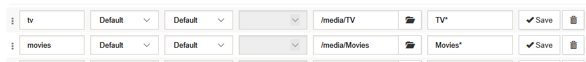

# Docker Home Media Server - Docker Apps

This section will detail the installation and configuratio aof al the docker relatd aplications that are used tomake up our ultimate home media server.

## Portainer

<p align="center">
  
</p>

[Portainer](https://www.portainer.io/) provides a WebUI to manage all your docker containers. I strongly recommend this for newbies. Here is the code to add (copy-paste) in the docker-compose file (pay attention to blank spaces at the beginning of each line):

```yaml
portainer:
    image: portainer/portainer
    container_name: portainer
    restart: always
    command: -H unix:///var/run/docker.sock
    ports:
      - "XXXX:9000"
    volumes:
      - /var/run/docker.sock:/var/run/docker.sock
      - ${USERID}/docker/portainer/data:/data
      - ${USERID}/docker/shared:/shared
    environment:
      - TZ=${TZ}
    networks:
      - traefik_proxy
    labels:
      traefik.enable: "true"
      traefik.home: "true"
      traefik.backend: portainer
      traefik.protocol: http
      traefik.port: 9000
      traefik.frontend.rule: Host:portainer.${DOMAINNAME}
      traefik.frontend.headers.SSLHost: portainer.${DOMAINNAME}
      traefik.docker.network: traefik_proxy
      traefik.frontend.passHostHeader: "true"
      traefik.frontend.headers.SSLForceHost: "true"
      traefik.frontend.headers.SSLRedirect: "true"
      traefik.frontend.headers.browserXSSFilter: "true"
      traefik.frontend.headers.contentTypeNosniff: "true"
      traefik.frontend.headers.forceSTSHeader: "true"
      traefik.frontend.headers.STSSeconds: 315360000
      traefik.frontend.headers.STSIncludeSubdomains: "true"
      traefik.frontend.headers.STSPreload: "true"
      traefik.frontend.headers.customResponseHeaders: X-Robots-Tag:noindex,nofollow,nosnippet,noarchive,notranslate,noimageindex
#      traefik.frontend.headers.frameDeny: "true" #customFrameOptionsValue overrides this
      traefik.frontend.headers.customFrameOptionsValue: 'allow-from https:${DOMAINNAME}'
      traefik.frontend.auth.forward.address: "http://oauth:4181"
      traefik.frontend.auth.forward.authResponseHeaders: X-Forwarded-User
      traefik.frontend.auth.forward.trustForwardHeader: "true"
```

### Replace/Configure:

```XXXX``` – port number on which you want the portainer Webui to be available at. It could be the same port as the container: 9000 (must be free). I stuck with ```9000```
After saving the ```docker-compose.yml``` file, run the following command to start the container and check if the app is accessible:

```bash
docker-compose -f ~/docker/docker-compose.yml up -d
```

Portainer WebUI should be available at http://SERVER-IP:XXXX. Repeat the above command after each container is added to ```docker-compose.yml``` file and ensure that the app works.

## Organizr

<p align="center">
  
</p>

Home media server with several apps may be cool but now you will have to remember all the different port numbers to access them. That is where [Organizr](https://organizr.app/) comes in. Organizr provides a unified interface to access all your home server apps so you do not have to remember them individually. The tabbed interface allows you to work on your server with ease. You can even setup users and give them access to specific apps. The calendar provides an overview of what TV show episodes are coming soon.  Docker makes it easier to install. Here is the code to add in the docker-compose file (pay attention to blank spaces at the beginning of each line):

```yaml
organizr-v2:
    container_name: organizr-v2
    restart: always
    image: organizrtools/organizr-v2
    volumes:
      - ${USERDIR}/docker/organizrv2:/config
      - ${USERDIR}/docker/sharedv2:/shared
    ports:
      - "XXXX:80"
    environment:
      - PUID=${PUID}
      - PGID=${PGID}
      - TZ=${TZ}
    networks:
      - traefik_proxy
    labels:
      - "traefik.enable=true"
      - "traefik.backend=organizr-v2"
      - "traefik.frontend.rule=Host:organizr.${DOMAINNAME}"
#      - "traefik.frontend.rule=Host:${DOMAINNAME}; PathPrefixStrip: /organizr"
      - "traefik.port=80"
      - "traefik.docker.network=traefik_proxy"
#      - "traefik.frontend.headers.SSLRedirect=true"
      - "traefik.frontend.headers.STSSeconds=315360000"
#      - "traefik.frontend.headers.browserXSSFilter=true"
#      - "traefik.frontend.headers.contentTypeNosniff=true"
#      - "traefik.frontend.headers.forceSTSHeader=true"
#      - "traefik.frontend.headers.SSLHost=${DOMAINNAME}"
#      - "traefik.frontend.headers.STSIncludeSubdomains=true"
#      - "traefik.frontend.headers.STSPreload=true"
#      - "traefik.frontend.headers.frameDeny=false"
      - "traefik.frontend.headers.customFrameOptionsValue=allow-from https://organizr.${DOMAINNAME}"
      - "traefik.frontend.passHostHeader=true"
```

### Replace/Configure:

```XXXX``` – port number on which you want the Organizr Webui to be available at. It could be the same port as the container: 80 (must be free). Port 80 is the default webserver port. So you do not need to specify the ```:80``` at the end of the IP Address or Domain Name. I used ```8841```
After saving the ```docker-compose.yml``` file, run the following command to start the container and check if the app is accessible:

```bash
docker-compose -f ~/docker/docker-compose.yml up -d
```

Organizr WebUI should be available at http://SERVER-IP:XXXX (:XXXX not needed if port 80 is used). 

## Maria DB - Database Server

<p align="center">
  
</p>

[MariaDB](https://mariadb.org/) is a community-developed fork of MySQL database system. It can serve as the central data location for all your apps that support it. In addition, for apps that save huge amount of data, a database such as MySQL can significantly improve performance over a file-based database such as SQLite (eg. Home Assistant, NextCloud).

```yaml
mariadb:
    image: "linuxserver/mariadb"
    container_name: "mariadb"
    hostname: mariadb
    volumes:
        - ${USERDIR}/docker/mariadb:/config
    ports:
      - target: 3306
        published: 3306
        protocol: tcp
        mode: host
    restart: always
    environment:
      - MYSQL_ROOT_PASSWORD=${MYSQL_ROOT_PASSWORD}
      - PUID=${PUID}
      - PGID=${PGID}
      - TZ=${TZ}
    labels:
      - "traefik.enable=false"
    networks:
      - default
```

### Replace/Configure:

1. ```${USERDIR}/docker/mariadb``` – Path to you want to save your database files. ```${USERDIR}``` is filled automatically from the environment file we created previously.
2. ```Ports``` – I recommend leaving the default port 3306 as is unless you know what you are doing.
3. ```MYSQL_ROOT_PASSWORD``` – Filled in automatically from the environment file we created previously.

Save and run the ```docker-compose.yml``` file as described previously and check if the container is working.

## phpMyAdmin - Manage MariaDB

<p align="center">
  
</p>

[phpMyAdmin](https://www.phpmyadmin.net/) is a free, open-source tool developed in PHP and intended to handle the administration of MySQL database management system (DBMS). It is designed to perform a wide range of operations on MySQL over the web. It offers the user-friendly web interface, support for most MySQL features, management of MySQL users and privileges, management of stored procedures and triggers, import and export of data from various sources, administration of multiple servers and much more.

```yaml
phpmyadmin:
    hostname: phpmyadmin
    container_name: phpmyadmin
    image: phpmyadmin/phpmyadmin
    restart: always
    links:
      - mariadb:db
    ports:
      - XXXX:80
    environment:
      - PMA_HOST=mariadb
      - MYSQL_ROOT_PASSWORD=${MYSQL_ROOT_PASSWORD}
    labels:
      traefik.enable: "true"
      traefik.home: "true"
      traefik.backend: phpmyadmin
      traefik.protocol: http
      traefik.port: 80
      traefik.frontend.rule: Host:pma.${DOMAINNAME}
      traefik.frontend.headers.SSLHost: pma.${DOMAINNAME}
      traefik.docker.network: traefik_proxy
      traefik.frontend.passHostHeader: "true"
      traefik.frontend.headers.SSLForceHost: "true"
      traefik.frontend.headers.SSLRedirect: "true"
      traefik.frontend.headers.browserXSSFilter: "true"
      traefik.frontend.headers.contentTypeNosniff: "true"
      traefik.frontend.headers.forceSTSHeader: "true"
      traefik.frontend.headers.STSSeconds: 315360000
      traefik.frontend.headers.STSIncludeSubdomains: "true"
      traefik.frontend.headers.STSPreload: "true"
      traefik.frontend.headers.customResponseHeaders: X-Robots-Tag:noindex,nofollow,nosnippet,noarchive,notranslate,noimageindex
#      traefik.frontend.headers.frameDeny: "true" #customFrameOptionsValue overrides this
      traefik.frontend.headers.customFrameOptionsValue: 'allow-from https:${DOMAINNAME}'
      traefik.frontend.auth.forward.address: "http://oauth:4181"
      traefik.frontend.auth.forward.authResponseHeaders: X-Forwarded-User
      traefik.frontend.auth.forward.trustForwardHeader: "true"
```

### Replace/Configure:

1. ```XXXX``` – I changed the default port to 8888.
2. ```MYSQL_ROOT_PASSWORD``` – Filled in automatically from the environment file we created previously.

Save and run the ```docker-compose.yml``` file as described previously and check if the container is working.

## Watchtower

<p align="center">
  
</p>

So we have built a kickass docker media server but it would be a pain if we have to watch each of the containers and update them manually. This is where [Watchtower](https://github.com/v2tec/watchtower) comes in. Watchtower monitors your Docker containers. If their images in the Docker Store change, then watchtower will pull the new image, shutdown the running container and restart with the new image and the options you originally set for the container while deploying. You can specify the frequency of update check as time interval or as cron time. Here is the code to add in the docker-compose file (pay attention to blank spaces at the beginning of each line):

```yaml
watchtower:
    container_name: watchtower
    restart: always
    image: v2tec/watchtower
    volumes:
      - /var/run/docker.sock:/var/run/docker.sock
    command: --schedule "0 0 4 * * *" --cleanup
```

### Replace/Configure:

1. ```--schedule "0 0 4 * * *"``` – containers are checked for updates at 4 am everyday. You can use the 6-digit cron schedule or you can specify time interval: ```--interval 30``` for checking every 30 seconds. Daily check is good enough for home use in my opinion. If you want weekly, then use ```0 0 23 * * SUN``` for every update at 11 pm on Sundays.

Save and run the ```docker-compose.yml``` file as described previously and check if the container is working. No need to do check or see anything with Watchtower. It just runs in the background and does its job.

## SABNZBD - Usenet

<p align="center">
  
</p>

[SABnzbd](https://sabnzbd.org/) is my favorite NZB newsgrabber client.  Here is the code to add in the docker-compose file (pay attention to blank spaces at the beginning of each line):

```yaml
sabnzbd:
    image: "linuxserver/sabnzbd"
    container_name: "sabnzbd"
    volumes:
      - ${USERDIR}/docker/sabnzbd:/config
      - ${MEDIADIR}/Usenet:/downloads
      - ${MEDIADIR}/incomplete:/incomplete-downloads
      - ${MEDIADIR}/NZB_Watched:/watched
      - ${USERDIR}/docker/shared:/shared
      - ${MEDIADIR}/Media:/media
    ports:
        - "8090:8080"
    restart: always
    environment:
      - PUID=${PUID}
      - PGID=${PGID}
      - TZ=${TZ}
    networks:
      - traefik_proxy
      - default
    labels:
      traefik.enable: "true"
      traefik.home: "true"
      traefik.backend: sabnzbd
      traefik.protocol: http
      traefik.port: 8080
      traefik.frontend.rule: Host:sabnzbd.${DOMAINNAME}
      traefik.frontend.headers.SSLHost: sabnzbd.${DOMAINNAME}
      traefik.docker.network: traefik_proxy
      traefik.frontend.passHostHeader: "true"
      traefik.frontend.headers.SSLForceHost: "true"
      traefik.frontend.headers.SSLRedirect: "true"
      traefik.frontend.headers.browserXSSFilter: "true"
      traefik.frontend.headers.contentTypeNosniff: "true"
      traefik.frontend.headers.forceSTSHeader: "true"
      traefik.frontend.headers.STSSeconds: 315360000
      traefik.frontend.headers.STSIncludeSubdomains: "true"
      traefik.frontend.headers.STSPreload: "true"
      traefik.frontend.headers.customResponseHeaders: X-Robots-Tag:noindex,nofollow,nosnippet,noarchive,notranslate,noimageindex
#      traefik.frontend.headers.frameDeny: "true" #customFrameOptionsValue overrides this
      traefik.frontend.headers.customFrameOptionsValue: 'allow-from https:${DOMAINNAME}'
      traefik.frontend.auth.forward.address: "http://oauth:4181"
      traefik.frontend.auth.forward.authResponseHeaders: X-Forwarded-User
      traefik.frontend.auth.forward.trustForwardHeader: "true"
```

### Replace/Configure:

1. ```${MEDIADIR}/Usenet``` – Path where to save downloaded files. ```${MEDIADIR}``` is filled automatically from the [environment file](https://docs.thelegendshub.com/#/Installing-Docker?id=setup-environmental-variables-for-docker) we created previously.
2. ```${MEDIADIR}/incomplete``` – Path where to save currently downloading files. ```${MEDIADIR}``` is filled automatically from the [environment file](https://docs.thelegendshub.com/#/Installing-Docker?id=setup-environmental-variables-for-docker) we created previously.
3. ```${MEDIADIR}/NZB_Watched``` – Path where to save NZB files that SABNZBD should watch in order to automatically download files. ```${MEDIADIR}``` is filled automatically from the [environment file](https://docs.thelegendshub.com/#/Installing-Docker?id=setup-environmental-variables-for-docker) we created previously.
4. ```${MEDIADIR}/Media``` – Path where all of your media is stored. For me, my media downloads into the ```{$MEDIADIR}\Downloads``` directory where it is then moved into the ```${MEDIADIR}/Media``` by SABNZBD automatically sorted in TV and Movie folders. 


```${MEDIADIR}``` is filled automatically from the [environment file](https://docs.thelegendshub.com/#/Installing-Docker?id=setup-environmental-variables-for-docker) we created previously.
5. ```XXXX``` – port number on which you want the SABnzbd Webui to be available at. I choose to use: 8090 (must be free).

Save and run the docker-compose.yml file as described previously and check if the app is working. SABnzbd WebUI should be available at http://SERVER-IP:XXXX.

## Radarr

<p align="center">
  
</p>

[Radarr](https://radarr.video/) is a Movie PVR. You add the movies you want to see to Radarr and it will search various bittorrent and Usenet providers for the movie. If it is available it will grab the index file and send it to your bittorrent client or NZB client for downloading. Once the download is complete it can rename your movie to a specified format and move it to a folder of your choice (movie library). It can even update your Kodi library or notify you when a new movie is ready for you to watch. Here is the code to add in the docker-compose file (pay attention to blank spaces at the beginning of each line):

```yaml
radarr:
    image: "linuxserver/radarr:preview"
    container_name: "radarr"
    volumes:
      - ${USERDIR}/docker/radarr:/config
      - ${MEDIADIR}/Usenet:/downloads
      - ${MEDIADIR}/Media/Movies:/movies
      - "/etc/localtime:/etc/localtime:ro"
      - ${USERDIR}/docker/shared:/shared
    ports:
      - "7878:7878"
    restart: always
    environment:
      - PUID=${PUID}
      - PGID=${PGID}
      - TZ=${TZ}
    labels:
      - "traefik.enable=true"
      - "traefik.backend=radarr"
      - "traefik.frontend.rule=Host:radarr.${DOMAINNAME}"
#      - "traefik.frontend.rule=Host:${DOMAINNAME}; PathPrefixStrip: /portainer"
      - "traefik.port=7878"
      - "traefik.protocol=http"
      - "traefik.docker.network=traefik_proxy"
      - "traefik.frontend.headers.SSLRedirect=true"
      - "traefik.frontend.headers.STSSeconds=315360000"
      - "traefik.frontend.headers.browserXSSFilter=true"
      - "traefik.frontend.headers.contentTypeNosniff=true"
      - "traefik.frontend.headers.forceSTSHeader=true"
      - "traefik.frontend.headers.SSLHost=${DOMAINNAME}"
      - "traefik.frontend.headers.STSIncludeSubdomains=true"
      - "traefik.frontend.headers.STSPreload=true"
      - "traefik.frontend.headers.frameDeny=true"

```

### Replace/Configure:

1. ```${MEDIADIR}/Usenet``` – Path where to save downloaded files. ```${MEDIADIR}``` is filled automatically from the [environment file](https://docs.thelegendshub.com/#/Installing-Docker?id=setup-environmental-variables-for-docker) we created previously.
2. ```${MEDIADIR}/Media/Movies``` – Path where all of your movies are stored. ```${MEDIADIR}``` is filled automatically from the [environment file](https://docs.thelegendshub.com/#/Installing-Docker?id=setup-environmental-variables-for-docker) we created previously.
3. ```XXXX``` – port number on which you want the Radarr Webui to be available at. I choose to use the default: 7878 (must be free).

Save and run the docker-compose.yml file as described previously and check if the app is working. Radarr WebUI should be available at http://SERVER-IP:XXXX.

## Sonarr

<p align="center">
  
</p>

[Sonarr](https://sonarr.tv/) is a PVR for TV Shows. You add the shows you want to see to Sonarr and it will search various bittorrent and Usenet providers for the show episodes. If it is available it will grab the index file and send it to your bitorrent client or NZB client for downloading. Once the download is complete it can rename your episode to a specified format and move it to a folder of your choice (TV Show library). It can even update your Kodi library or notify you when a new episode is ready for you to watch. Here is the code to add in the docker-compose file (pay attention to blank spaces at the beginning of each line):

```yaml
sonarr:
    image: "linuxserver/sonarr:preview"
    container_name: "sonarr"
    volumes:
      - ${USERDIR}/docker/sonarr:/config
      - ${MEDIADIR}/Usenet:/downloads
      - ${MEDIADIR}/Media/TV:/tv
      - "/etc/localtime:/etc/localtime:ro"
      - ${USERDIR}/docker/shared:/shared
    ports:
      - "8989:8989"
    restart: always
    environment:
      - PUID=${PUID}
      - PGID=${PGID}
      - TZ=${TZ}
    labels:
      - "traefik.enable=true"
      - "traefik.backend=sonarr"
      - "traefik.frontend.rule=Host:sonarr.${DOMAINNAME}"
#      - "traefik.frontend.rule=Host:${DOMAINNAME}; PathPrefixStrip: /portainer"
      - "traefik.port=8989"
      - "traefik.protocol=http"
      - "traefik.docker.network=traefik_proxy"
      - "traefik.frontend.headers.SSLRedirect=true"
      - "traefik.frontend.headers.STSSeconds=315360000"
      - "traefik.frontend.headers.browserXSSFilter=true"
      - "traefik.frontend.headers.contentTypeNosniff=true"
      - "traefik.frontend.headers.forceSTSHeader=true"
      - "traefik.frontend.headers.SSLHost=${DOMAINNAME}"
      - "traefik.frontend.headers.STSIncludeSubdomains=true"
      - "traefik.frontend.headers.STSPreload=true"
      - "traefik.frontend.headers.frameDeny=true"

```

### Replace/Configure:

1. ```${MEDIADIR}/Usenet``` – Path where to save downloaded files. ```${MEDIADIR}``` is filled automatically from the [environment file](https://docs.thelegendshub.com/#/Installing-Docker?id=setup-environmental-variables-for-docker) we created previously.
2. ```${MEDIADIR}/Media/TV``` – Path where all of your TV Shows are stored. ```${MEDIADIR}``` is filled automatically from the [environment file](https://docs.thelegendshub.com/#/Installing-Docker?id=setup-environmental-variables-for-docker) we created previously.
3. ```XXXX``` – port number on which you want the Sonarr Webui to be available at. I choose to use the default: 8989 (must be free).

Save and run the docker-compose.yml file as described previously and check if the app is working. Sonarr WebUI should be available at http://SERVER-IP:XXXX.

## Emby

<p align="center">
  
</p>

[Emby](https://emby.media/) is a media server designed to organize, play, and stream audio and video to a variety of devices. It supports most devices (iOS, Android, Android TV, Windows, Kodi etc). This is what I use as my primary media server. Here is the code to add in the docker-compose file (pay attention to blank spaces at the beginning of each line):

```yaml
emby:
    image: emby/embyserver
    container_name: emby
    # net: host
    restart: always
    ports:
      - 8096:8096
      - 8920:8920
    volumes:
      - /etc/localtime:/etc/localtime:ro
      - ${USERDIR}/docker/embyserver:/config
      - ${MEDIADIR}/Media:/media
      - ${MEDIADIR}/Music:/music
      - /mnt/Seagate_HDD:/Seagate_HDD
    environment:
      - AUTO_UPDATES_ON=true
      - PUID=${PUID}
      - PGID=${PGID}
    networks:
      - traefik_proxy
      - default
    labels:
      - "traefik.enable=true"
      - "traefik.backend=emby"
      - "traefik.frontend.rule=Host:emby.${DOMAINNAME}"
#      - "traefik.frontend.rule=Host:${DOMAINNAME}; PathPrefixStrip: /portainer"
      - "traefik.port=8096"
      - "traefik.protocol=http"
      - "traefik.docker.network=traefik_proxy"
      - "traefik.frontend.headers.SSLRedirect=true"
      - "traefik.frontend.headers.STSSeconds=315360000"
      - "traefik.frontend.headers.browserXSSFilter=true"
      - "traefik.frontend.headers.contentTypeNosniff=true"
      - "traefik.frontend.headers.forceSTSHeader=true"
      - "traefik.frontend.headers.SSLHost=${DOMAINNAME}"
      - "traefik.frontend.headers.STSIncludeSubdomains=true"
      - "traefik.frontend.headers.STSPreload=true"
      - "traefik.frontend.headers.frameDeny=true"

```

### Replace/Configure:

1. ```${MEDIADIR}/Music``` – Path where all of your Music is stored. If it is in the same place as all of your media, then there is no need for a separate volume. ```${MEDIADIR}``` is filled automatically from the [environment file](https://docs.thelegendshub.com/#/Installing-Docker?id=setup-environmental-variables-for-docker) we created previously.
2. ```${MEDIADIR}/Media``` – Path where all of your Media is stored. ```${MEDIADIR}``` is filled automatically from the [environment file](https://docs.thelegendshub.com/#/Installing-Docker?id=setup-environmental-variables-for-docker) we created previously.
3. Add any additional Media volumes. For example, I have more media stored on ```/mnt/Seagate_HDD```
4. ```XXXX``` – port number on which you want the Emby Webui to be available at. I choose to use the default: 8096 (must be free).

Save and run the docker-compose.yml file as described previously and check if the app is working. Emby WebUI should be available at http://SERVER-IP:XXXX.

## Alternative Media App - Jellyfin

<p align="center">
  
</p>

[Jellyfin](https://jellyfin.org/) is a media server designed to organize, play, and stream audio and video to a variety of devices. It supports most devices (iOS, Android, Android TV, Windows, Kodi etc). This is an open source media server which has been based off Emby. Here is the code to add in the docker-compose file (pay attention to blank spaces at the beginning of each line):

```yaml
jellyfin:
     image: jellyfin/jellyfin
     container_name: jellyfin
     network_mode: host
#     user: 1001:1001
     volumes:
       - ${USERDIR}/docker/jellyfin/config:/config
       - ${MEDIADIR}/Media:/media
       - ${MEDIADIR}/Music:/Music
       - /mnt/Seagate_HDD:/Seagate_HDD
       - ${MEDIADIR}:/MediaDir
     environment:
       - TZ=${TZ}
       - PUID=${PUID}
       - PGID=${PGID}
     ports:
       - "8196:8096"
       - "9920:8920"
     restart: always
    networks:
      - traefik_proxy
      - default
    labels:
      - "traefik.enable=true"
      - "traefik.backend=jellyfin"
      - "traefik.frontend.rule=Host:jellyfin.${DOMAINNAME}"
#      - "traefik.frontend.rule=Host:${DOMAINNAME}; PathPrefixStrip: /portainer"
      - "traefik.port=8196"
      - "traefik.protocol=http"
      - "traefik.docker.network=traefik_proxy"
      - "traefik.frontend.headers.SSLRedirect=true"
      - "traefik.frontend.headers.STSSeconds=315360000"
      - "traefik.frontend.headers.browserXSSFilter=true"
      - "traefik.frontend.headers.contentTypeNosniff=true"
      - "traefik.frontend.headers.forceSTSHeader=true"
      - "traefik.frontend.headers.SSLHost=${DOMAINNAME}"
      - "traefik.frontend.headers.STSIncludeSubdomains=true"
      - "traefik.frontend.headers.STSPreload=true"
      - "traefik.frontend.headers.frameDeny=true"

```

### Replace/Configure:

1. ```${MEDIADIR}/Music``` – Path where all of your Music is stored. If it is in the same place as all of your media, then there is no need for a separate volume. ```${MEDIADIR}``` is filled automatically from the [environment file](https://docs.thelegendshub.com/#/Installing-Docker?id=setup-environmental-variables-for-docker) we created previously.
2. ```${MEDIADIR}/Media``` – Path where all of your Media is stored. ```${MEDIADIR}``` is filled automatically from the [environment file](https://docs.thelegendshub.com/#/Installing-Docker?id=setup-environmental-variables-for-docker) we created previously.
3. ```XXXX``` – port number on which you want the Jellyfin Webui to be available at. I choose to use the default: 8096 (must be free).

Save and run the docker-compose.yml file as described previously and check if the app is working. Jellyfin WebUI should be available at http://SERVER-IP:XXXX.

## Alternative Media App - Plex

<p align="center">
  
</p>

[Plex](https://plex.tv/) is a media server designed to organize, play, and stream audio and video to a variety of devices. This is an alternative to Emby. I personally prefer Emby/Jellyfin over Plex. Here is the code to add in the docker-compose file (pay attention to blank spaces at the beginning of each line):

```yaml
plexms:
    container_name: plexms
    restart: always
    image: plexinc/pms-docker
    volumes:
      - ${USERDIR}/docker/plexms:/config
      - ${MEDIADIR}/Plex_Transcode:/transcode
      - ${MEDIADIR}/Media:/media
      - ${USERDIR}/docker/shared:/shared
    ports:
      - "32400:32400/tcp"
      - "3005:3005/tcp"
      - "8324:8324/tcp"
      - "32469:32469/tcp"
      - "1900:1900/udp"
      - "32410:32410/udp"
      - "32412:32412/udp"
      - "32413:32413/udp"
      - "32414:32414/udp"
    environment:
      - TZ=${TZ}
      - HOSTNAME="Media-PC"
      - PLEX_CLAIM="claim-XXXXXXXXXXX"
      - PLEX_UID=${PUID}
      - PLEX_GID=${PGID}
      - ADVERTISE_IP="http://SERVER-IP:32400/"
    labels:
      - "traefik.enable=true"
      - "traefik.backend=plexms"
      - "traefik.frontend.rule=Host:plex.${DOMAINNAME}"
#      - "traefik.frontend.rule=Host:${DOMAINNAME}; PathPrefixStrip: /portainer"
      - "traefik.port=8096"
      - "traefik.protocol=http"
      - "traefik.docker.network=traefik_proxy"
      - "traefik.frontend.headers.SSLRedirect=true"
      - "traefik.frontend.headers.STSSeconds=315360000"
      - "traefik.frontend.headers.browserXSSFilter=true"
      - "traefik.frontend.headers.contentTypeNosniff=true"
      - "traefik.frontend.headers.forceSTSHeader=true"
      - "traefik.frontend.headers.SSLHost=${DOMAINNAME}"
      - "traefik.frontend.headers.STSIncludeSubdomains=true"
      - "traefik.frontend.headers.STSPreload=true"
      - "traefik.frontend.headers.frameDeny=true"

```

### Replace/Configure:

1. ```${MEDIADIR}/Transcode``` – Path where you would like to store your temporary transcoding files. If it is in the same place as all of your media, then there is no need for a separate volume. ```${MEDIADIR}``` is filled automatically from the [environment file](https://docs.thelegendshub.com/#/Installing-Docker?id=setup-environmental-variables-for-docker) we created previously.
2. ```${MEDIADIR}/Media``` – Path where all of your Media is stored. ```${MEDIADIR}``` is filled automatically from the [environment file](https://docs.thelegendshub.com/#/Installing-Docker?id=setup-environmental-variables-for-docker) we created previously.
3. ```HOSTNAME``` - Name your plex server.
4. ```PLEX-CLAIM``` - Your Plex access claim code from [here](https://www.plex.tv/claim/). The word “claim” in front of the code must be in lower case.
5. ```ADVERTISE_IP``` – IP Address of your server (eg. 192.168.1.100) – you can get this from your router admin page or run ifconfig in terminal.

Save and run the docker-compose.yml file as described previously and check if the app is working. Plex WebUI should be available at http://SERVER-IP:32400.

## Ombi - Accept Requests for your Media Server

<p align="center">
  
</p>

[Ombi](https://www.ombi.io/) is a self-hosted web application that automatically gives your shared Plex or Emby users the ability to request content by themselves! Ombi can be linked to multiple TV Show and Movie DVR tools to create a seamless end-to-end experience for your users.

```yaml
ombi:
    container_name: ombi
    restart: always
    image: linuxserver/ombi
    volumes:
      - ${USERDIR}/docker/ombi:/config
      - ${USERDIR}/docker/shared:/shared
    ports:
      - "XXXX:3579"
    environment:
      - PUID=${PUID}
      - PGID=${PGID}
      - TZ=${TZ}
```

### Replace/Configure:

1. ```XXXX``` – I changed the default port to 3579.

Save and run the docker-compose.yml file as described previously and check if the app is working. Plex WebUI should be available at http://SERVER-IP:3579.


## NZBHydra – NZB Meta Search

<p align="center">
  
</p>

[NZBHydra2](https://github.com/theotherp/nzbhydra) is a meta search for NZB indexers with easy access to a number of raw and newznab based indexers. It provides a unified interface to search all of your indexers from one place and also use it as indexer source for apps like Sickrage, Sonarr, and CouchPotato. 

```yaml
hydra:
    image: "linuxserver/hydra2"
    container_name: "hydra2"
    volumes:
      - ${USERDIR}/docker/hydra:/config
      - ${MEDIADIR}/Usenet:/downloads
      - ${USERDIR}/docker/shared:/shared
    ports:
      - "XXXX:5075"
    restart: always
    environment:
      - PUID=${PUID}
      - PGID=${PGID}
      - TZ=${TZ}
```

### Replace/Configure:

1. ```XXXX``` – I changed the default port to 5075.

Save and run the docker-compose.yml file as described previously and check if the app is working. NZBHydra WebUI should be available at http://SERVER-IP:5075.

## NextCloud – Your Own Cloud Storage

<p align="center">
  
</p>

[Nextcloud](https://nextcloud.com) allows you to run your own cloud storage service on your home server. It is an alternative to Owncloud and created by the former founder of Owncloud. In many ways both services are similar. Nextcloud runs on your server, protects your files, and gives you secure access to your files from desktop or mobile devices from anywhere. You can also sync and share your data across devices.

```yaml
nextcloud:
    container_name: nextcloud
    restart: always
    image: linuxserver/nextcloud
    volumes:
      - ${USERDIR}/docker/nextcloud:/config
      - ${USERDIR}/shared_data:/data
      - ${USERDIR}/docker/shared:/shared
    ports:
      - "XXXX:443"
    environment:
      - PUID=${PUID}
      - PGID=${PGID}
    networks:
      - traefik_proxy
    labels:
      traefik.enable: "true"
      traefik.home: "true"
      traefik.backend: nextcloud
      traefik.protocol: https
      traefik.port: 443
      traefik.frontend.rule: Host:nextcloud.${DOMAINNAME}
      traefik.frontend.headers.SSLHost: nextcloud.${DOMAINNAME}
      traefik.docker.network: traefik_proxy
      traefik.frontend.passHostHeader: "true"
      traefik.frontend.headers.SSLForceHost: "true"
      traefik.frontend.headers.SSLRedirect: "true"
      traefik.frontend.headers.browserXSSFilter: "true"
      traefik.frontend.headers.contentTypeNosniff: "true"
      traefik.frontend.headers.forceSTSHeader: "true"
      traefik.frontend.headers.STSSeconds: 315360000
      traefik.frontend.headers.STSIncludeSubdomains: "true"
      traefik.frontend.headers.STSPreload: "true"
      traefik.frontend.headers.customResponseHeaders: X-Robots-Tag:noindex,nofollow,nosnippet,noarchive,notranslate,noimageindex
#      traefik.frontend.headers.frameDeny: "true" #customFrameOptionsValue overrides this
      traefik.frontend.headers.customFrameOptionsValue: 'allow-from https:${DOMAINNAME}'
      traefik.frontend.auth.forward.address: "http://oauth:4181"
      traefik.frontend.auth.forward.authResponseHeaders: X-Forwarded-User
      traefik.frontend.auth.forward.trustForwardHeader: "true"
```

### Replace/Configure:

1. ```XXXX``` – I changed the default port to 8822.
2. ```${USERDIR}/shared_data``` – Path to data you want to share/sync. ```${USERDIR}``` is filled automatically from the environment file we created previously.

Save and run the docker-compose.yml file as described previously and check if the app is working. Nextcloud WebUI should be available at http://SERVER-IP:XXXX.
